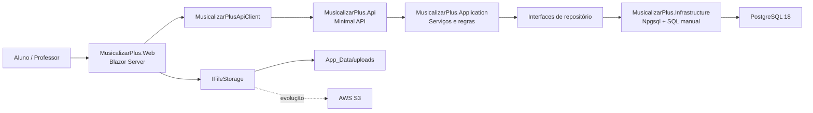
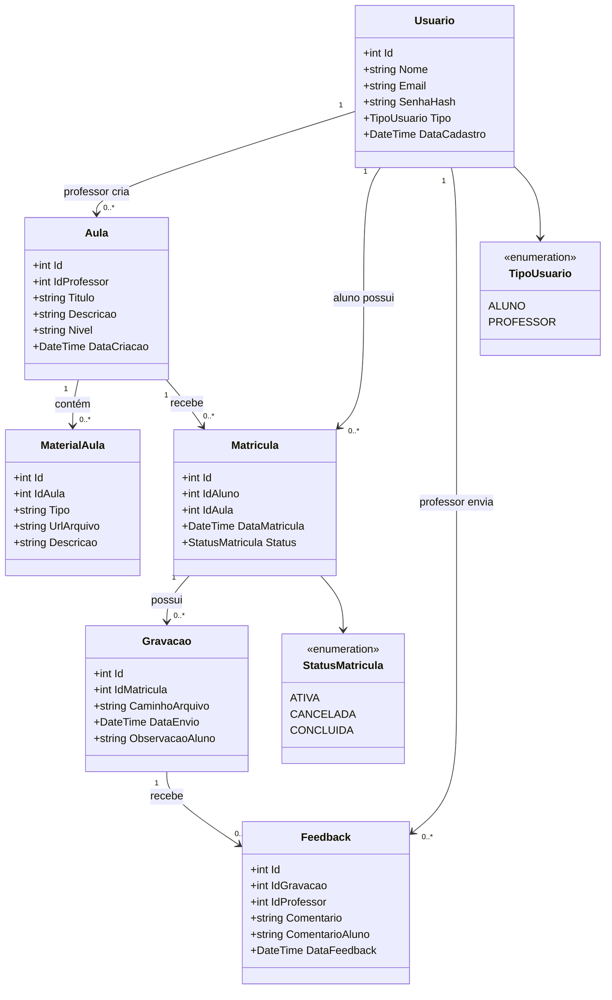
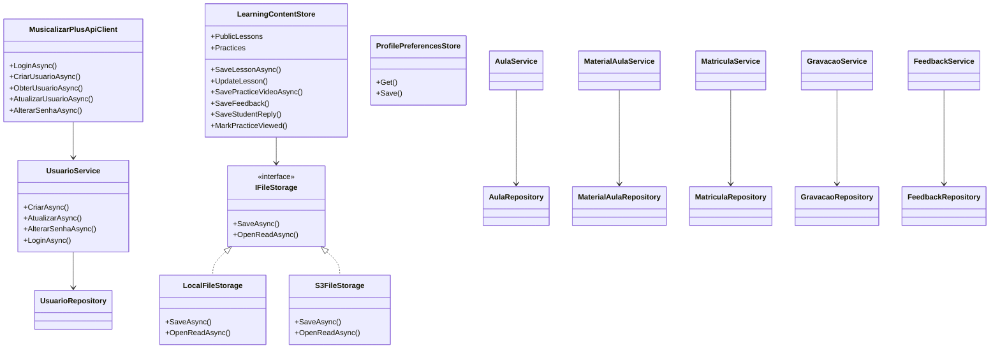
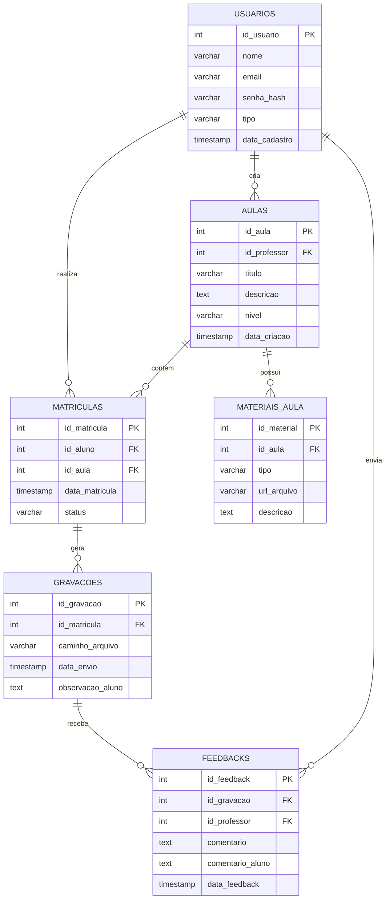
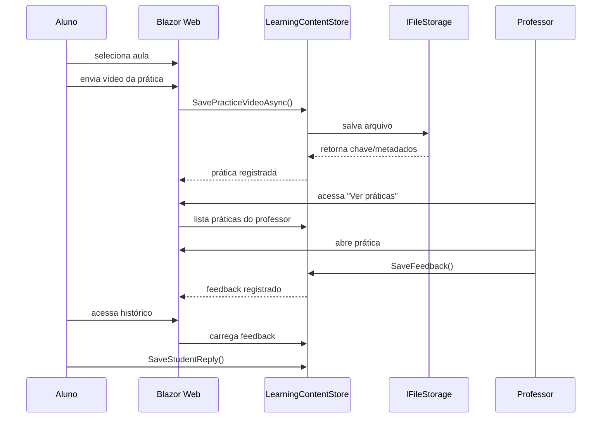
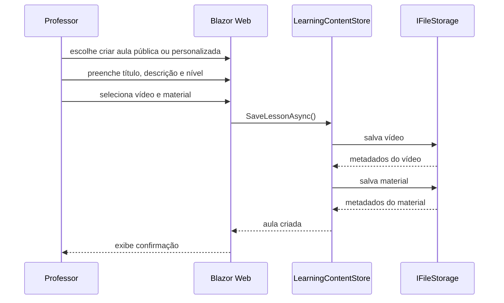

# Musicalizar+

## Documentação final do Trabalho de Conclusão de Curso

**Projeto:** Musicalizar+  
**Tipo de sistema:** Plataforma web educacional para apoio ao ensino musical  
**Tecnologias:** .NET 10, Blazor Server, ASP.NET Core Minimal API, PostgreSQL 18, Npgsql, SQL manual, Git LFS  
**Repositório:** https://github.com/DarluceReis/MusicalizarPlus  

---

## Resumo

O Musicalizar+ é uma plataforma web desenvolvida para apoiar o processo de ensino e aprendizagem musical, centralizando aulas, materiais de apoio, vídeos de prática, feedbacks e respostas entre professores e alunos. O sistema foi construído com .NET 10, utilizando Blazor Server para a interface, uma API separada com ASP.NET Core Minimal API, PostgreSQL 18 como banco de dados relacional e acesso a dados por SQL manual com Npgsql, sem Entity Framework.

O projeto contempla autenticação de usuários, visão específica para alunos e professores, cadastro de aulas públicas e personalizadas, envio de vídeos, anexação de materiais em PDF, histórico de práticas, notificações e fluxo de feedback. A entrega também inclui scripts SQL, documentação técnica, arquivos de demonstração e versionamento no GitHub com Git LFS para arquivos maiores.

---

## Sumário

1. Introdução  
2. Problema  
3. Justificativa  
4. Objetivos  
5. Escopo do projeto  
6. Público-alvo e atores  
7. Requisitos funcionais  
8. Requisitos não funcionais  
9. Ferramentas e tecnologias utilizadas  
10. Arquitetura da solução  
11. Modelagem do banco de dados  
12. Diagramas do sistema  
13. Casos de uso  
14. Funcionalidades implementadas  
15. Segurança  
16. Armazenamento de arquivos  
17. Execução local  
18. Contas de demonstração  
19. Testes e validação  
20. Limitações e melhorias futuras  
21. Conclusão  
22. Link da defesa em vídeo  

---

## 1. Introdução

O ensino musical exige acompanhamento constante, prática frequente e retorno pedagógico individualizado. Em aulas presenciais, remotas ou híbridas, é comum que professores enviem conteúdos, vídeos, exercícios e feedbacks por canais diferentes, como aplicativos de mensagem, e-mail, links externos ou pastas compartilhadas. Essa dispersão dificulta o acompanhamento do estudo e a organização do processo de aprendizagem.

O Musicalizar+ foi desenvolvido como uma solução web para centralizar esse fluxo. A plataforma permite que professores publiquem aulas, anexem materiais, acompanhem práticas enviadas pelos alunos e registrem feedbacks. Os alunos, por sua vez, podem acessar aulas, consultar materiais, enviar vídeos de prática e acompanhar o histórico de avaliações.

O sistema foi planejado como uma aplicação acadêmica funcional, com foco em demonstrar os principais fluxos de uma plataforma de ensino musical e uma arquitetura organizada em camadas.

---

## 2. Problema

O problema identificado está relacionado à falta de centralização no acompanhamento de aulas musicais e práticas dos alunos.

Em um cenário comum:

- o professor envia vídeos por um canal;
- o material de apoio fica em outro local;
- o aluno envia práticas por mensagem;
- o feedback retorna em formato textual ou áudio separado;
- o histórico das avaliações se perde ao longo do tempo;
- o professor não consegue visualizar facilmente quais alunos ainda precisam de retorno.

Essa falta de organização prejudica tanto o aluno quanto o professor. O aluno perde referências de estudo e não acompanha claramente sua evolução. O professor, por sua vez, precisa controlar manualmente práticas, feedbacks e materiais.

O Musicalizar+ resolve esse problema ao reunir em um único ambiente:

- aulas públicas;
- aulas personalizadas;
- vídeos das aulas;
- documentos de apoio;
- práticas enviadas por alunos;
- feedbacks do professor;
- respostas do aluno;
- notificações de novas atividades.

---

## 3. Justificativa

A criação do Musicalizar+ se justifica pela necessidade de uma ferramenta simples, direcionada e organizada para apoiar o ensino musical.

Embora existam plataformas gerais de ensino, muitas não contemplam de forma direta o fluxo de prática em vídeo, correção individual e resposta do aluno. No contexto musical, esse fluxo é essencial, pois o professor precisa ver ou ouvir a execução do aluno para orientar postura, ritmo, técnica e evolução.

O projeto também se justifica academicamente por reunir diferentes competências do desenvolvimento web:

- criação de interface com Blazor;
- desenvolvimento de API;
- modelagem de banco relacional;
- uso de SQL manual;
- autenticação;
- upload de arquivos;
- separação em camadas;
- versionamento no GitHub;
- documentação técnica.

---

## 4. Objetivos

### 4.1 Objetivo geral

Desenvolver uma plataforma web para apoio ao ensino musical, permitindo a gestão de aulas, envio de práticas em vídeo e acompanhamento por feedback entre professores e alunos.

### 4.2 Objetivos específicos

- Permitir cadastro e login de alunos e professores.
- Restringir o acesso às funcionalidades internas a usuários autenticados.
- Criar uma visão específica para alunos.
- Criar uma visão específica para professores.
- Permitir cadastro de aulas públicas.
- Permitir cadastro de aulas personalizadas.
- Permitir anexar vídeo e material complementar às aulas.
- Permitir que alunos enviem vídeos de prática.
- Permitir que professores visualizem práticas enviadas.
- Permitir que professores registrem feedback.
- Permitir que alunos visualizem e respondam feedbacks.
- Apresentar histórico de práticas do aluno.
- Apresentar notificações de novas práticas ou respostas.
- Utilizar PostgreSQL com SQL manual.
- Organizar o código em camadas.
- Versionar o projeto no GitHub.

---

## 5. Escopo do projeto

### 5.1 Funcionalidades entregues

O projeto entregue contempla:

- tela de login;
- tela de cadastro;
- autenticação por cookie;
- visão do aluno;
- visão do professor;
- proteção de páginas internas por autenticação;
- listagem de aulas gerais;
- listagem de aulas personalizadas;
- busca de aulas;
- player de vídeo para aulas;
- envio de prática em vídeo;
- histórico de práticas;
- status de prática aguardando avaliação;
- status de prática avaliada;
- feedback do professor;
- resposta do aluno ao feedback;
- envio de vídeo-resposta;
- painel inicial do professor;
- criação de aula pública;
- criação de aula privada/personalizada;
- upload de vídeo da aula;
- upload de material PDF;
- edição de aulas;
- visualização de alunos vinculados;
- busca de alunos;
- visualização de práticas enviadas;
- notificações de novas práticas/respostas;
- edição de perfil;
- alteração de senha;
- documentação técnica;
- scripts SQL;
- versionamento com Git e GitHub;
- uso de Git LFS para vídeos e PDFs.

### 5.2 Fora do escopo da versão entregue

Alguns recursos foram planejados como evolução futura, mas não fazem parte da entrega principal:

- pagamento de mensalidades;
- chat em tempo real;
- videochamada;
- recuperação de senha por e-mail;
- painel administrativo completo;
- publicação definitiva em produção;
- transcodificação automática de vídeos;
- streaming otimizado com CDN;
- relatórios estatísticos avançados.

---

## 6. Público-alvo e atores

### 6.1 Aluno

Usuário que acessa aulas, assiste vídeos, baixa materiais, envia práticas e responde feedbacks.

### 6.2 Professor

Usuário que cria aulas, acompanha alunos, visualiza práticas, envia feedbacks e gerencia conteúdos.

### 6.3 Banca avaliadora

Usuário indireto do projeto, responsável por avaliar a solução desenvolvida, a documentação, a demonstração e a adequação ao problema proposto.

---

## 7. Requisitos funcionais

| Código | Requisito | Situação |
|---|---|---|
| RF01 | Permitir cadastro de usuário como aluno ou professor | Implementado |
| RF02 | Permitir login de usuário | Implementado |
| RF03 | Direcionar aluno e professor para áreas diferentes | Implementado |
| RF04 | Bloquear páginas internas sem autenticação | Implementado |
| RF05 | Listar aulas públicas para alunos | Implementado |
| RF06 | Listar aulas personalizadas para alunos | Implementado |
| RF07 | Buscar aulas por texto | Implementado |
| RF08 | Exibir vídeo da aula | Implementado |
| RF09 | Permitir download/acesso a material complementar | Implementado |
| RF10 | Permitir envio de prática em vídeo pelo aluno | Implementado |
| RF11 | Registrar prática no histórico do aluno | Implementado |
| RF12 | Exibir práticas enviadas na área do professor | Implementado |
| RF13 | Permitir professor enviar feedback | Implementado |
| RF14 | Permitir aluno responder feedback | Implementado |
| RF15 | Permitir aluno enviar vídeo-resposta | Implementado |
| RF16 | Exibir notificações para novas práticas ou respostas | Implementado |
| RF17 | Permitir criação de aula pública | Implementado |
| RF18 | Permitir criação de aula personalizada | Implementado |
| RF19 | Permitir edição de aulas | Implementado |
| RF20 | Permitir visualização e busca de alunos pelo professor | Implementado |
| RF21 | Permitir edição de dados de perfil | Implementado |
| RF22 | Permitir alteração de senha | Implementado |
| RF23 | Permitir anexar vídeo e PDF em aula | Implementado |

---

## 8. Requisitos não funcionais

| Código | Requisito | Atendimento |
|---|---|---|
| RNF01 | Aplicação web responsiva para uso em navegador | Atendido parcialmente com foco desktop |
| RNF02 | Uso de .NET 10 | Atendido |
| RNF03 | Uso de PostgreSQL 18 | Atendido |
| RNF04 | Não utilizar Entity Framework | Atendido |
| RNF05 | Utilizar SQL manual | Atendido |
| RNF06 | Separar responsabilidades em camadas | Atendido |
| RNF07 | Armazenar senha com hash seguro | Atendido |
| RNF08 | Permitir evolução para armazenamento em nuvem | Atendido |
| RNF09 | Versionar o projeto no GitHub | Atendido |
| RNF10 | Documentar execução e funcionamento | Atendido |

---

## 9. Ferramentas e tecnologias utilizadas

### 9.1 .NET 10

Utilizado como plataforma principal para desenvolvimento da aplicação Web, API e bibliotecas auxiliares.

### 9.2 Blazor Server

Utilizado na interface do usuário, permitindo criar telas interativas com C# e Razor Components.

### 9.3 ASP.NET Core Minimal API

Utilizado para criar os endpoints do backend de forma simples, objetiva e organizada.

### 9.4 PostgreSQL 18

Banco relacional utilizado para persistência estruturada de usuários, aulas, materiais, matrículas, gravações e feedbacks.

### 9.5 Npgsql

Biblioteca utilizada para comunicação direta entre .NET e PostgreSQL, executando comandos SQL manualmente.

### 9.6 PBKDF2

Algoritmo utilizado para hash de senhas, com salt aleatório e 100.000 iterações.

### 9.7 AWS SDK S3

Adicionado para preparar o sistema para armazenamento futuro de arquivos em bucket S3.

### 9.8 Git e GitHub

Utilizados para versionamento e publicação do projeto.

### 9.9 Git LFS

Utilizado para versionar vídeos e PDFs de demonstração sem prejudicar o repositório Git principal.

---

## 10. Arquitetura da solução

O projeto foi estruturado em camadas, separando interface, API, regras de aplicação, domínio, contratos e infraestrutura.

```text
MusicalizarPlus
├── db
│   ├── 001_initial.sql
│   ├── 002_seed.sql
│   └── 003_demo_logins.sql
├── docs
│   └── DOCUMENTACAO_TCC.md
├── src
│   ├── MusicalizarPlus.Api
│   ├── MusicalizarPlus.Application
│   ├── MusicalizarPlus.Contracts
│   ├── MusicalizarPlus.Domain
│   ├── MusicalizarPlus.Infrastructure
│   └── MusicalizarPlus.Web
└── README.md
```

### 10.1 Camada Web

Projeto: `MusicalizarPlus.Web`

Responsável por:

- telas de login;
- telas de cadastro;
- área do aluno;
- área do professor;
- componentes compartilhados;
- upload de arquivos;
- exibição de vídeos;
- integração com API;
- armazenamento local/S3 por abstração.

### 10.2 Camada API

Projeto: `MusicalizarPlus.Api`

Responsável por expor endpoints HTTP para:

- autenticação;
- usuários;
- aulas;
- materiais;
- matrículas;
- gravações;
- feedbacks.

### 10.3 Camada Application

Projeto: `MusicalizarPlus.Application`

Responsável por:

- serviços de aplicação;
- validações;
- regras de negócio;
- contratos de repositórios;
- padronização de resultados.

### 10.4 Camada Domain

Projeto: `MusicalizarPlus.Domain`

Responsável por:

- entidades principais;
- enumerações;
- representação do domínio.

### 10.5 Camada Contracts

Projeto: `MusicalizarPlus.Contracts`

Responsável por:

- DTOs de entrada;
- DTOs de resposta;
- contratos compartilhados entre API e Web.

### 10.6 Camada Infrastructure

Projeto: `MusicalizarPlus.Infrastructure`

Responsável por:

- acesso ao PostgreSQL;
- comandos SQL manuais;
- repositórios;
- hash de senha;
- configuração de dependências.

---

## 11. Modelagem do banco de dados

O banco relacional foi modelado com as seguintes tabelas:

- `usuarios`;
- `aulas`;
- `materiais_aula`;
- `matriculas`;
- `gravacoes`;
- `feedbacks`.

### 11.1 Tabela usuarios

Armazena alunos e professores.

Campos principais:

- `id_usuario`;
- `nome`;
- `email`;
- `senha_hash`;
- `tipo`;
- `data_cadastro`.

### 11.2 Tabela aulas

Armazena aulas criadas por professores.

Campos principais:

- `id_aula`;
- `id_professor`;
- `titulo`;
- `descricao`;
- `nivel`;
- `data_criacao`.

### 11.3 Tabela materiais_aula

Armazena os materiais complementares das aulas.

Campos principais:

- `id_material`;
- `id_aula`;
- `tipo`;
- `url_arquivo`;
- `descricao`.

### 11.4 Tabela matriculas

Relaciona alunos e aulas.

Campos principais:

- `id_matricula`;
- `id_aluno`;
- `id_aula`;
- `data_matricula`;
- `status`.

### 11.5 Tabela gravacoes

Armazena práticas enviadas por alunos.

Campos principais:

- `id_gravacao`;
- `id_matricula`;
- `caminho_arquivo`;
- `data_envio`;
- `observacao_aluno`.

### 11.6 Tabela feedbacks

Armazena feedback do professor e resposta do aluno.

Campos principais:

- `id_feedback`;
- `id_gravacao`;
- `id_professor`;
- `comentario`;
- `comentario_aluno`;
- `data_feedback`.

---

## 12. Diagramas do sistema

### 12.1 Diagrama de arquitetura



### 12.2 Diagrama de caso de uso

```mermaid
flowchart TB
    Aluno((Aluno))
    Professor((Professor))

    UC_Login["Realizar login"]
    UC_Cadastro["Criar conta"]
    UC_Perfil["Editar perfil"]
    UC_AlterarSenha["Alterar senha"]

    UC_ListarAulas["Visualizar aulas"]
    UC_BuscarAulas["Buscar aulas"]
    UC_AssistirAula["Assistir vídeo da aula"]
    UC_BaixarMaterial["Baixar material de apoio"]
    UC_EnviarPratica["Enviar prática em vídeo"]
    UC_Historico["Consultar histórico de práticas"]
    UC_VerFeedback["Visualizar feedback"]
    UC_ResponderFeedback["Responder feedback"]
    UC_EnviarVideoResposta["Enviar vídeo-resposta"]

    UC_PainelProfessor["Visualizar painel do professor"]
    UC_CriarPublica["Criar aula pública"]
    UC_CriarPrivada["Criar aula personalizada"]
    UC_AnexarVideo["Anexar vídeo da aula"]
    UC_AnexarMaterial["Anexar material PDF"]
    UC_EditarAulas["Editar aulas"]
    UC_VerAlunos["Visualizar alunos"]
    UC_BuscarAlunos["Buscar alunos"]
    UC_VerPraticas["Visualizar práticas"]
    UC_AvaliarPratica["Enviar feedback"]
    UC_Notificacoes["Visualizar notificações"]

    Aluno --> UC_Login
    Aluno --> UC_Cadastro
    Aluno --> UC_Perfil
    Aluno --> UC_AlterarSenha
    Aluno --> UC_ListarAulas
    Aluno --> UC_BuscarAulas
    Aluno --> UC_AssistirAula
    Aluno --> UC_BaixarMaterial
    Aluno --> UC_EnviarPratica
    Aluno --> UC_Historico
    Aluno --> UC_VerFeedback
    Aluno --> UC_ResponderFeedback
    Aluno --> UC_EnviarVideoResposta

    Professor --> UC_Login
    Professor --> UC_Cadastro
    Professor --> UC_Perfil
    Professor --> UC_AlterarSenha
    Professor --> UC_PainelProfessor
    Professor --> UC_CriarPublica
    Professor --> UC_CriarPrivada
    Professor --> UC_AnexarVideo
    Professor --> UC_AnexarMaterial
    Professor --> UC_EditarAulas
    Professor --> UC_VerAlunos
    Professor --> UC_BuscarAlunos
    Professor --> UC_VerPraticas
    Professor --> UC_AvaliarPratica
    Professor --> UC_Notificacoes

    UC_CriarPublica --> UC_AnexarVideo
    UC_CriarPublica --> UC_AnexarMaterial
    UC_CriarPrivada --> UC_AnexarVideo
    UC_CriarPrivada --> UC_AnexarMaterial
    UC_VerPraticas --> UC_AvaliarPratica
    UC_VerFeedback --> UC_ResponderFeedback
    UC_VerFeedback --> UC_EnviarVideoResposta
```



### 12.3 Diagrama de classes do domínio



### 12.4 Diagrama de classes de serviços e infraestrutura



### 12.5 Diagrama entidade-relacionamento



### 12.6 Sequência: envio de prática e feedback



### 12.7 Sequência: criação de aula



---

## 13. Casos de uso

### 13.1 UC01 - Realizar login

**Ator:** aluno ou professor  
**Objetivo:** acessar a plataforma com credenciais válidas.  
**Pré-condição:** usuário cadastrado.  
**Fluxo principal:**

1. O usuário informa e-mail e senha.
2. O sistema envia as credenciais para validação.
3. O sistema verifica a senha.
4. O sistema cria a sessão autenticada.
5. O usuário é direcionado para a área correspondente ao seu perfil.

**Pós-condição:** usuário autenticado.

### 13.2 UC02 - Visualizar aulas do aluno

**Ator:** aluno  
**Objetivo:** acessar aulas públicas e personalizadas.  
**Fluxo principal:**

1. O aluno realiza login.
2. O sistema exibe aulas personalizadas.
3. O sistema exibe aulas gerais.
4. O aluno pode buscar aulas.
5. O aluno abre uma aula.

**Pós-condição:** aula disponível para estudo.

### 13.3 UC03 - Enviar prática

**Ator:** aluno  
**Objetivo:** enviar vídeo de prática para avaliação.  
**Fluxo principal:**

1. O aluno acessa a aula.
2. O aluno entra na tela de envio de prática.
3. O aluno seleciona um vídeo.
4. O sistema salva o arquivo.
5. O sistema registra a prática.
6. O professor passa a visualizar a prática.

**Pós-condição:** prática pendente para avaliação.

### 13.4 UC04 - Visualizar histórico de práticas

**Ator:** aluno  
**Objetivo:** acompanhar práticas enviadas e feedbacks.  
**Fluxo principal:**

1. O aluno acessa o histórico.
2. O sistema exibe práticas enviadas.
3. O sistema informa se a prática está avaliada ou aguardando avaliação.
4. O aluno abre uma prática.
5. O aluno visualiza o feedback, se existir.

### 13.5 UC05 - Responder feedback

**Ator:** aluno  
**Objetivo:** responder orientação enviada pelo professor.  
**Fluxo principal:**

1. O aluno abre uma prática avaliada.
2. O aluno lê o feedback.
3. O aluno escreve uma resposta.
4. O sistema salva a resposta.
5. O professor passa a ser notificado da nova resposta.

### 13.6 UC06 - Criar aula pública

**Ator:** professor  
**Objetivo:** publicar aula disponível para todos os alunos.  
**Fluxo principal:**

1. O professor acessa “Adicionar nova aula”.
2. O professor escolhe aula pública.
3. O professor informa título, descrição e nível.
4. O professor anexa vídeo e material, quando necessário.
5. O sistema salva a aula.

### 13.7 UC07 - Criar aula personalizada

**Ator:** professor  
**Objetivo:** criar aula direcionada a um aluno específico.  
**Fluxo principal:**

1. O professor acessa “Adicionar nova aula”.
2. O professor escolhe aula personalizada.
3. O sistema exibe alunos vinculados ao professor.
4. O professor seleciona o aluno.
5. O professor informa título, descrição e nível.
6. O professor anexa vídeo e material.
7. O sistema salva a aula personalizada.

### 13.8 UC08 - Avaliar prática

**Ator:** professor  
**Objetivo:** enviar feedback para prática enviada pelo aluno.  
**Fluxo principal:**

1. O professor acessa “Ver práticas”.
2. O sistema lista práticas dos seus alunos.
3. O professor abre uma prática.
4. O professor assiste ao vídeo.
5. O professor escreve o feedback.
6. O sistema salva o feedback.
7. O aluno passa a visualizar a avaliação.

### 13.9 UC09 - Visualizar alunos

**Ator:** professor  
**Objetivo:** consultar alunos vinculados.  
**Fluxo principal:**

1. O professor acessa “Visualizar alunos”.
2. O sistema lista seus alunos.
3. O professor pode buscar pelo nome.

### 13.10 UC10 - Editar perfil

**Ator:** aluno ou professor  
**Objetivo:** alterar dados pessoais.  
**Fluxo principal:**

1. O usuário acessa “Meus dados”.
2. O usuário edita informações permitidas.
3. O usuário salva.
4. O sistema atualiza os dados.

---

## 14. Funcionalidades implementadas

### 14.1 Login e cadastro

O sistema possui telas separadas para login e criação de conta. O cadastro permite escolher o tipo de usuário: aluno ou professor. Após o login, o sistema identifica o papel do usuário e redireciona para a área correta.

### 14.2 Proteção de rotas

As páginas internas utilizam autenticação. Usuários não autenticados são redirecionados para login.

### 14.3 Visão do aluno

Na visão do aluno foram implementadas:

- lista de aulas;
- aulas personalizadas;
- aulas gerais;
- campo de busca;
- visualização de vídeo;
- acesso a material complementar;
- envio de prática;
- histórico de práticas;
- visualização de feedback;
- resposta ao feedback;
- envio de vídeo-resposta;
- edição de perfil.

### 14.4 Visão do professor

Na visão do professor foram implementadas:

- painel inicial;
- menu lateral;
- criação de aula pública;
- criação de aula personalizada;
- upload de vídeo;
- upload de material PDF;
- edição de aulas;
- visualização de alunos;
- busca de alunos;
- visualização de práticas;
- envio de feedback;
- notificações;
- edição de perfil;
- alteração de senha.

### 14.5 Fluxo de feedback

O fluxo de feedback representa o núcleo pedagógico do projeto:

1. professor publica aula;
2. aluno estuda a aula;
3. aluno envia prática;
4. professor avalia;
5. aluno visualiza feedback;
6. aluno responde com texto ou vídeo.

Esse fluxo demonstra o objetivo principal do Musicalizar+: organizar o acompanhamento do aprendizado musical.

---

## 15. Segurança

O sistema implementa medidas importantes de segurança:

- armazenamento de senha com PBKDF2-SHA256;
- uso de salt aleatório;
- 100.000 iterações no hash;
- comparação segura de hash;
- autenticação por cookie;
- proteção de páginas internas;
- arquivos locais de desenvolvimento ignorados no Git;
- conexão de banco configurável por ambiente.

### 15.1 Cuidados para produção

Em ambiente real, recomenda-se:

- obrigar HTTPS;
- usar variáveis de ambiente para segredos;
- armazenar arquivos em bucket privado;
- usar URLs assinadas para vídeos;
- implementar limite e validação de tipos de arquivo;
- adicionar logs e monitoramento;
- configurar backup do banco.

---

## 16. Armazenamento de arquivos

O sistema trabalha com uma interface chamada `IFileStorage`, permitindo alternar entre armazenamento local e S3.

### 16.1 Armazenamento local

Durante o desenvolvimento e demonstração, os arquivos são salvos em:

```text
src/MusicalizarPlus.Web/App_Data/uploads
```

Pastas utilizadas:

```text
aulas/videos
aulas/materiais
praticas/videos
perfil/fotos
```

### 16.2 Preparação para AWS S3

O projeto possui implementação para S3 por meio da classe `S3FileStorage`. A configuração prevista é:

```json
{
  "Storage": {
    "Provider": "S3",
    "S3": {
      "BucketName": "nome-do-bucket",
      "Region": "us-east-1",
      "Prefix": "musicalizarplus"
    }
  }
}
```

Para produção, a recomendação é manter vídeos e PDFs fora do banco de dados. O banco deve guardar apenas os metadados e a chave do arquivo.

---

## 17. Execução local

### 17.1 Pré-requisitos

- .NET 10 SDK;
- PostgreSQL 18;
- Git;
- Git LFS.

### 17.2 Clonar repositório

```powershell
git clone https://github.com/DarluceReis/MusicalizarPlus.git
cd MusicalizarPlus
git lfs pull
```

### 17.3 Criar banco de dados

```powershell
createdb -h localhost -p 5433 -U postgres musicalizarplus
```

### 17.4 Executar scripts SQL

```powershell
psql -h localhost -p 5433 -U postgres -d musicalizarplus -f db/001_initial.sql
psql -h localhost -p 5433 -U postgres -d musicalizarplus -f db/002_seed.sql
psql -h localhost -p 5433 -U postgres -d musicalizarplus -f db/003_demo_logins.sql
```

### 17.5 Configurar appsettings

Copiar arquivos de exemplo:

```powershell
copy src\MusicalizarPlus.Api\appsettings.Development.example.json src\MusicalizarPlus.Api\appsettings.Development.json
copy src\MusicalizarPlus.Web\appsettings.Development.example.json src\MusicalizarPlus.Web\appsettings.Development.json
```

Editar a senha do PostgreSQL em:

```text
src/MusicalizarPlus.Api/appsettings.Development.json
```

### 17.6 Compilar

```powershell
dotnet restore MusicalizarPlus.slnx
dotnet build MusicalizarPlus.slnx
```

### 17.7 Executar API

```powershell
dotnet run --project src/MusicalizarPlus.Api --launch-profile http
```

URL:

```text
http://localhost:5298
```

### 17.8 Executar Web

```powershell
dotnet run --project src/MusicalizarPlus.Web --launch-profile http
```

URL:

```text
http://localhost:5030
```

---

## 18. Contas de demonstração

Senha padrão:

```text
P@ssw0rd
```

### Professor

```text
vinicius.prof@musicalizarplus.local
```

### Alunos

```text
joao.aluno@musicalizarplus.local
ana.aluno@musicalizarplus.local
daniela.aluno@musicalizarplus.local
rui.aluno@musicalizarplus.local
```

### Alunos vinculados ao professor Vinicius Alves

- João Alves;
- Ana Maria;
- Daniela Roc.;
- Rui Barbosa;
- Marina Costa;
- Caio Lima.

---

## 19. Testes e validação

Durante o desenvolvimento foram realizadas validações manuais dos principais fluxos:

- cadastro de usuário;
- login de aluno;
- login de professor;
- proteção de páginas internas;
- visualização de aulas;
- busca de aulas;
- criação de aula pública;
- criação de aula personalizada;
- upload de vídeo;
- upload de material PDF;
- envio de prática;
- visualização de prática pelo professor;
- envio de feedback;
- resposta do aluno;
- envio de vídeo-resposta;
- histórico de práticas;
- notificações;
- edição de perfil;
- alteração de senha.

Também foi executado o build da aplicação para validação técnica:

```powershell
dotnet build MusicalizarPlus.slnx
```

Em verificações realizadas durante o desenvolvimento, o projeto compilou com sucesso após os ajustes finais.

---

## 20. Limitações e melhorias futuras

Apesar de funcional para a proposta acadêmica, o sistema possui possibilidades de evolução:

- publicar a aplicação em ambiente de produção;
- substituir dados locais de demonstração por persistência integral em banco;
- integrar totalmente os metadados de arquivos ao PostgreSQL;
- usar AWS S3 com bucket privado em produção;
- usar CloudFront para distribuição de vídeos;
- implementar recuperação de senha;
- implementar painel administrativo;
- adicionar relatórios de progresso;
- adicionar controle de turmas;
- adicionar chat entre aluno e professor;
- adicionar testes automatizados;
- melhorar responsividade para dispositivos móveis;
- adicionar logs de auditoria.

---

## 21. Conclusão

O Musicalizar+ atende à proposta do Trabalho de Conclusão de Curso ao entregar uma plataforma web funcional para apoio ao ensino musical. O sistema resolve o problema de dispersão de aulas, práticas, materiais e feedbacks ao centralizar esses elementos em uma única aplicação.

A plataforma contempla dois perfis principais: aluno e professor. O aluno consegue acessar aulas, enviar práticas e acompanhar feedbacks. O professor consegue criar aulas, acompanhar alunos, visualizar práticas e registrar avaliações. O fluxo implementado demonstra o ciclo pedagógico essencial: publicação de conteúdo, estudo, prática, avaliação e resposta.

Do ponto de vista técnico, o projeto utiliza tecnologias modernas e uma organização em camadas, com separação entre interface, API, aplicação, domínio, contratos e infraestrutura. O uso de PostgreSQL com SQL manual atende ao requisito de trabalhar diretamente com banco relacional sem Entity Framework. O versionamento no GitHub, a documentação e a preparação para armazenamento em nuvem reforçam a possibilidade de evolução do sistema.

Dessa forma, o projeto demonstra uma solução coerente, funcional e alinhada ao objetivo proposto.

---

## 22. Link da defesa em vídeo

Inserir o link da defesa gravada ao final da documentação:

```text
https://drive.google.com/file/d/1A7tDee4gTa0P-G-oD-FGXCGUedd6xbOB/view?usp=sharing
```

---

## 23. Referências

- Microsoft. Documentação oficial do .NET.  
- Microsoft. Documentação oficial do ASP.NET Core e Blazor.  
- PostgreSQL Global Development Group. Documentação oficial do PostgreSQL.  
- Npgsql. Documentação oficial do driver Npgsql para .NET.  
- Amazon Web Services. Documentação oficial do Amazon S3.  
- GitHub. Documentação oficial do GitHub e Git LFS.  

